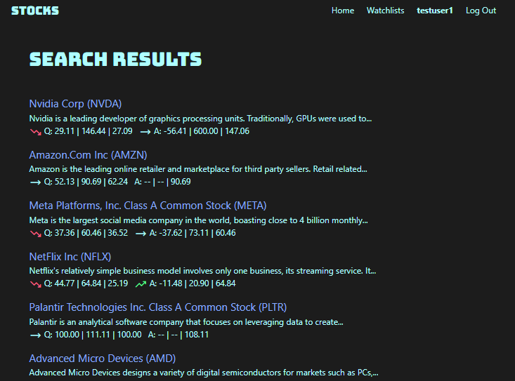
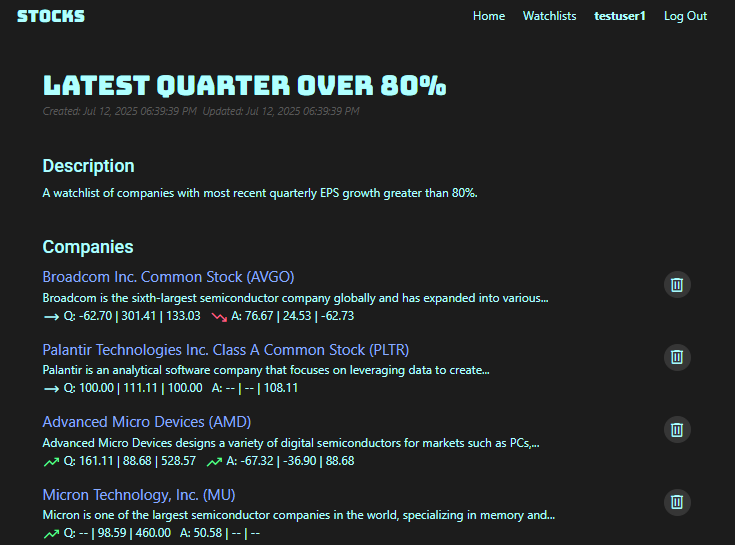

# Stocks
### Project Description
- Lightweight stock fundamentals research app inspired in part by the CANSLIM criteria developed by legendary investor Bill O'Neil. 
- Search for companies by EPS growth and number of institutional holders. Read about companies and visualize data. Create watchlists to track these metrics over time. Includes companies trading on the NYSE and NASDAQ.
- Based on free APIs. Some companies may not appear due to API constraints, including recent IPOs, companies with recent ticker changes, and companies with irregular earnings report dates. There are currently about 1000 companies available in the database.
- Try it out: [https://flask-stocks.onrender.com/](https://flask-stocks.onrender.com/).
  > ⚠️ **Note:** Deployed on Render's free tier. If app has been idle, it can take **half a minute to start**. This delay only occurs on first load.

### User Flow
- `Register/Log In` from the home page. The registration form only validates syntax so using a fake email works great.
- Once logged in, you can toggle between two search forms. `Multiple Conditions Search` lets you add and subtract form fields using the `+` and `-` buttons to tailor a complex search. If you already have a particular company in mind, click `Switch to Ticker Search` button to search by an individual ticker.

  

- A cool feature from within the search results page is a (truncated) company description, and colored icons indicating trends in quarterly and annual EPS growth, including these numbers and number of institutional holders. This saves you time if you're searching for particular kinds of businesses, or particular trends in the data.

  

- If you want to save your search results in a watchlist, click the `Save Results in Watchlist` button, at the bottom of the results page.
- Click on company names from the results page to view information about an individual company.

  

- If you have already created one or more watchlists, they will appear in a drop-down menu at the bottom of the company info page. Use this to add companies to your existing lists.
- From the navigation menu at the top, view and edit your existing watchlists using the `Watchlists` button. You can delete watchlists using the trash buttons on the watchlists page, or by clicking the `Delete Watchlist` button within the page for an individual list.
- Edit your watchlist title and/or description using the `Edit Watchlist` button from within the individual watchlist page. You can also remove companies from the watchlist by clicking the trash buttons.

  

- To view and edit your user information, including deleting your account, click your username, which appears in **bold** on the navigation menu.

  

- Click `Log Out`on the top right to exit.

### APIs
- [Financial Modeling Prep](https://site.financialmodelingprep.com/developer/docs/stable) (for ticker symbols and annual EPS numbers).
- [polygon.io](https://polygon.io/docs/rest/stocks/overview) (for quarterly EPS numbers and company descriptions).

### Technologies Used

Deployed with 
Database hosted on 

*App database schema diagram in Supabase*

---

Submitted on 2023-01-28 to fulfill the requirements of Capstone 1 project for Springboard's Software Engineering Career Track.

Enjoy!
